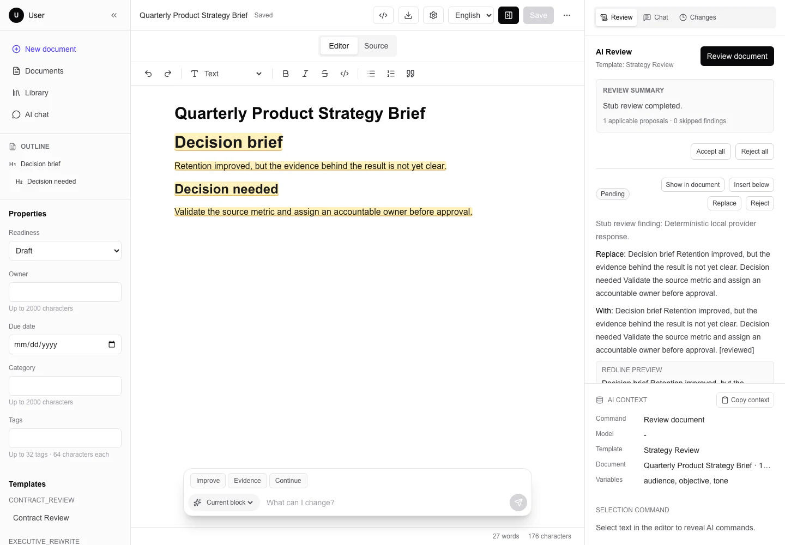
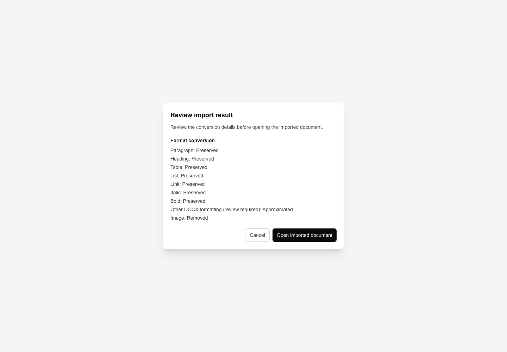

# Coredot Editor

Build an AI-assisted document product from a working full-stack starter.

[](https://github.com/CoreDotToday/coredot-editor/actions/workflows/ci.yml)
[](https://coredottoday.github.io/coredot-editor/)
[](LICENSE)

Coredot Editor combines a Tiptap workspace, Proposal-based AI changes, durable history, Clerk Workspaces, SQLite/libSQL persistence, and fidelity-aware DOCX interchange in one Next.js application.

It is an application starter to clone and adapt. It is not an npm editor component, a hosted SaaS service, or a promise of full Microsoft Word compatibility.

[Documentation](https://coredottoday.github.io/coredot-editor/) · [Product tour](docs/product-tour.md) · [Getting started](docs/getting-started.md) · [Architecture](docs/ARCHITECTURE.md)

[](docs/assets/screenshots/workspace.webp)

_The complete Workspace keeps navigation, the current draft, and AI review in one product surface._

## Why Adopt This Starter?

- **Start from a working product.** Document editing, templates, Conversations, change history, DOCX interchange, persistence, authentication, and automated tests are already connected.
- **Keep AI changes reviewable.** AI Runs create Proposals instead of editing documents directly. Revision checks protect acceptance and undo from stale writes.
- **Adapt through explicit seams.** Providers, prompts, Project Profiles, plugins, identity, and persistence each have a documented replacement point.

## Workflow At A Glance

1. Write in the Tiptap editor and save against the document's current revision.
2. Run a review or rewrite from a draft snapshot. The AI Run may create zero or more Proposals.
3. Inspect each redline. Pending or rejected Proposals do not change the document.
4. Accept one or a batch with `expectedRevision`. A successful operation creates one atomic Document Change and a new revision.
5. Recover from stale saves without silently discarding the local draft. Undo restores the server snapshot only while its revision precondition still holds.

[](docs/assets/screenshots/proposal-review.webp)

_Proposal review makes the target text, replacement, rationale, and apply decision visible before the document changes._

[](docs/assets/screenshots/docx-fidelity.webp)

_DOCX import and export report preserved, approximated, and removed features; lossy export requires acknowledgement._

## Capabilities And Boundaries

| Area | Implemented baseline | Deliberate boundary |
| --- | --- | --- |
| Editing | Three-pane Workspace, Tiptap v3, commands, outline, find/replace, and Korean/English UI | The repository is a full application, not a packaged editor component or real-time collaboration engine |
| AI | Deterministic `stub`, Core.Today proxy modes, and direct OpenAI; structured review creates Proposals | Live providers require server-side credentials; the stub proves the flow, not model quality |
| Change safety | Revision-aware saves, atomic single/bulk Proposal apply, durable Document Changes, and revision-checked undo | This is optimistic revision control, not CRDT synchronization |
| Identity | Clerk personal/organization Workspaces with owner/admin/member roles; deterministic test identity for local use | `AUTH_MODE=test` is rejected by production build and startup validation |
| Persistence | Drizzle repositories with SQLite/libSQL and Workspace-scoped predicates | Deployments own durable hosting, backups, restore drills, and any Postgres migration |
| DOCX | Two-phase import/export with bounded worker conversion and explicit fidelity reports | Reports surface known loss; they do not claim full Word parity |
| Project Profiles | Code-owned metadata, readiness, filters, labels, and template defaults | One server-owned Profile is selected per deployment, not per Workspace |
| Plugins | Seven build-time contribution hosts with dependency ordering and failure isolation | There is no runtime third-party plugin loader or marketplace |

See the [Product Tour](docs/product-tour.md) for the complete user journey and [Production Readiness](docs/production-readiness.md) for operator-owned decisions.

## Quick Evaluation

Requirements: Node.js 20 or newer and pnpm 10 or newer.

```bash
pnpm install --frozen-lockfile
cp .env.example .env.local
pnpm db:setup
pnpm dev
```

Open `http://localhost:3000`. The example environment uses `AI_PROVIDER=stub` and `AUTH_MODE=test`, so the product flow works locally without an external model key or Clerk account.

Verify the same install, environment, migration, seed, startup, and HTTP path in an isolated temporary repository:

```bash
pnpm docs:verify-quick-start
```

For explanations and troubleshooting, continue with [Getting Started](docs/getting-started.md) and [Development](docs/development.md).

## Authentication And Configuration

Local evaluation and production deployment intentionally use different identity modes.

| Context | Required configuration | Meaning |
| --- | --- | --- |
| Local evaluation and automated tests | `AUTH_MODE=test` | Creates one deterministic owner Principal and Workspace; never use it for deployed users |
| Production | `AUTH_MODE=clerk`, `NEXT_PUBLIC_CLERK_PUBLISHABLE_KEY`, `CLERK_SECRET_KEY` | Uses Clerk identity; organizations become shared Workspaces and users without an active organization receive personal Workspaces |
| Build verification only | Clerk mode with the fixed test-shaped values documented in [Configuration](docs/configuration.md#production-verification) | Satisfies the production preflight but does not authenticate anyone |

Production build and startup fail closed when test authentication is selected or Clerk keys are blank. Store real Clerk and AI provider credentials in the deployment secret manager.

`.env.example` lists every supported setting. Read [Configuration](docs/configuration.md) before changing identity, provider, storage, Profile, or model settings.

## Architecture And Product Flow

Every protected request resolves a Principal, Workspace, role, and request ID. Pages and routes pass that context into services and Workspace-scoped repositories backed by SQLite/libSQL.

AI execution and DOCX conversion remain behind bounded service seams. External providers receive only server-side calls, while DOCX conversion runs in a terminable worker.

- [Product change flow](docs/assets/diagrams/product-flow.svg) — draft snapshot, AI Run, Proposal branches, atomic apply, conflict, and undo.
- [System boundaries](docs/assets/diagrams/system-boundaries.svg) — identity, Request Context, protected application, services, persistence, providers, and DOCX worker.
- [System Architecture](docs/ARCHITECTURE.md) — exact contracts and source boundaries.
- [Architecture Hardening](docs/architecture-hardening.md) — enforced safety invariants and remaining operator work.

## Adopt With A Project Profile

[Adopting The Starter](docs/ADOPTION.md) maps the repository seams to a safe fork sequence. [Project Profiles](docs/project-profiles.md) provides concrete starting points for different document products.

A Profile defines code-owned metadata, readiness transitions, list filters, localized labels, and default templates. `PROJECT_PROFILE_ID` selects one Profile for the deployment; the browser cannot choose it.

Use a Profile for shared domain policy. Use editor plugins for product-specific interactions and document schema contributions.

## Extension Map

| Change | Start here | Preserve |
| --- | --- | --- |
| AI provider or model behavior | [Configuration](docs/configuration.md) and [provider catalog](src/features/ai/provider-catalog.ts) | Server-only credentials, provider contracts, deadlines, and structured Proposal output |
| Prompt templates | [Prompting](docs/PROMPTING.md) | Variable validation and Proposal contracts |
| Domain fields and workflow | [Project Profiles](docs/project-profiles.md) | Server-owned Profile selection and legacy metadata preservation |
| Editor commands, panels, or schema | [Editor Plugins](docs/PLUGINS.md) | Stable IDs, dependency ordering, host isolation, and the shared browser/worker schema Profile |
| Identity | [Clerk ADR](docs/adr/0001-clerk-for-identity-and-workspace-context.md) | Fail-closed production validation, roles, Request Context, and repository Workspace predicates |
| Database | [Architecture](docs/ARCHITECTURE.md#sqlite-today-postgres-later) | Atomic document changes, scoped authorization, migrations, and concurrency tests |

Plugins are statically registered in source control. The current hosts cover Tiptap extensions, selection commands, slash commands, toolbar items, block actions, Workspace panels, and settings sections.

## Operate A Fork

Coredot Editor supplies a production-oriented baseline, not a complete SaaS operating model.

Before real users, choose durable database hosting, backups, retention, observability, provider secrets, recovery scheduling, and a DOCX validation corpus.

Run the complete repository finish line before release:

```bash
pnpm release:check
pnpm e2e:production
.venv-docs/bin/python -m mkdocs build --strict
git diff --check
```

`release:check` runs lint, typecheck, Vitest, development Playwright E2E, production-auth startup verification, the production build, and the configured moderate-or-higher dependency audit.

The production smoke builds and starts an artifact against an isolated migrated database, then checks health, readiness, redirects, and protected-route behavior with bounded cleanup.

Continue with [Production Readiness](docs/production-readiness.md), [Deployment](docs/DEPLOYMENT.md), and the [Security Policy](SECURITY.md).

## Choose A Documentation Route

- **Explore:** [Product Tour](docs/product-tour.md) and [Project Profiles](docs/project-profiles.md).
- **Build:** [Getting Started](docs/getting-started.md), [Development](docs/development.md), [Configuration](docs/configuration.md), and [API Reference](docs/api-reference.md).
- **Extend:** [Adopting The Starter](docs/ADOPTION.md), [Editor Plugins](docs/PLUGINS.md), and [Prompting](docs/PROMPTING.md).
- **Operate:** [Architecture](docs/ARCHITECTURE.md), [Production Readiness](docs/production-readiness.md), and [Deployment](docs/DEPLOYMENT.md).

## Contributing And Project Policy

Contributions are welcome. Read [Contributing](CONTRIBUTING.md), the [Code of Conduct](CODE_OF_CONDUCT.md), and [Community](docs/community.md) before opening a pull request.

Report sensitive vulnerabilities through the private process in [Security](SECURITY.md), not a public issue. Current direction and project stewardship are documented in the [Roadmap](docs/ROADMAP.md) and [Maintainers](docs/MAINTAINERS.md).

Coredot Editor is available under the [MIT License](LICENSE).
