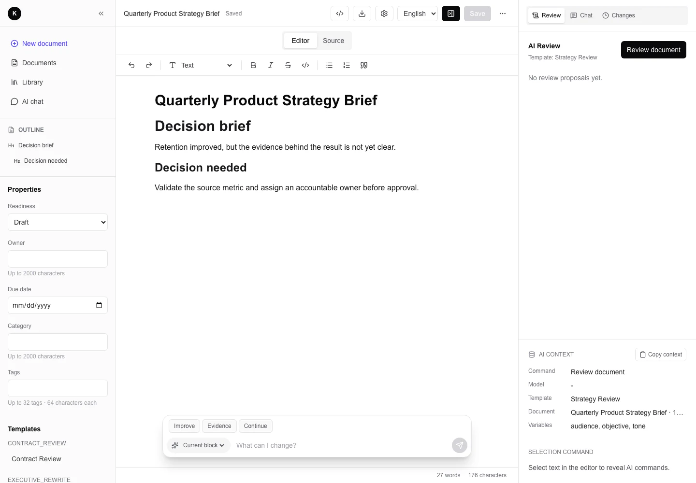

<section class="docs-hero" aria-labelledby="coredot-editor" markdown>
  <div class="docs-hero__copy" markdown>

<p class="docs-eyebrow">OPEN-SOURCE FULL-STACK STARTER</p>

# Coredot Editor {#coredot-editor aria-label="Coredot Editor"}

Build an AI-assisted document product from a working editor, Proposal review loop, durable change history, and explicit extension seams.

<p class="docs-boundary"><strong>Forkable application starter.</strong> Not an npm editor component. Not a hosted SaaS.</p>

<div class="docs-actions" markdown>
[Start locally](getting-started.md){ .md-button .md-button--primary }
[Product tour](product-tour.md){ .md-button }
</div>

  </div>
  <figure class="docs-hero__visual">
    <a href="assets/screenshots/workspace.webp">
      
    </a>
    <figcaption>A real local capture: document context, editing, and review stay visible in one Workspace.</figcaption>
  </figure>
</section>

<dl class="docs-proof-strip">
  <div>
    <dt>Revision checked</dt>
    <dd>Stale saves and Proposal application return a conflict instead of overwriting newer content.</dd>
  </div>
  <div>
    <dt>Workspace scoped</dt>
    <dd>Repository reads and writes include the authenticated Workspace boundary.</dd>
  </div>
  <div>
    <dt>Loss made visible</dt>
    <dd>DOCX import and export report preserved, approximated, and removed features.</dd>
  </div>
  <div>
    <dt>Bounded execution</dt>
    <dd>AI requests and DOCX conversion enforce size and time limits; stale AI Runs have a recovery command.</dd>
  </div>
</dl>

## A product loop you can inspect

Coredot Editor keeps model output separate from the document until a person accepts it. That choice is carried through the UI, API, transaction boundary, and tests.

<ol class="docs-workflow">
  <li><span>01</span><div><strong>Write with context</strong><p>Edit Tiptap JSON beside document metadata, an outline, templates, and the current AI context.</p></div></li>
  <li><span>02</span><div><strong>Generate Proposals</strong><p>Review and rewrite commands persist suggestions rather than silently replacing the draft.</p></div></li>
  <li><span>03</span><div><strong>Decide explicitly</strong><p>Accept one or a batch, insert below, reject, or leave work pending for later.</p></div></li>
  <li><span>04</span><div><strong>Recover safely</strong><p>Atomic Document Changes keep bounded before-snapshots; server undo checks the current revision.</p></div></li>
</ol>

[See the complete product flow](product-tour.md#follow-a-change-from-draft-to-recovery) or inspect the [document-change contract](ARCHITECTURE.md#revision-and-document-change-lifecycle).

## What is implemented—and where the boundary stays honest

The repository includes the editor, deterministic stub AI, Clerk and local test identity adapters, Workspace authorization, Proposal review, durable Conversations, Project Profiles, static plugins, and fidelity-aware DOCX interchange.

It does **not** provide real-time collaborative editing, Word layout parity, a runtime third-party plugin marketplace, or a hosted service. Those are explicit downstream decisions, not implied features.

Use [Project Profiles](project-profiles.md) for domain fields and readiness. Use [Plugins](PLUGINS.md) for editor behavior, [Prompting](PROMPTING.md) for model contracts, and [Configuration](configuration.md) for providers and persistence.

## Choose your path

<nav class="docs-reader-paths" aria-label="Documentation paths">
  <a href="product-tour/"><span>Explore</span><strong>See the product workflow</strong><small>Three real captures, change branches, and trust boundaries.</small><b aria-hidden="true">&#8599;</b></a>
  <a href="getting-started/"><span>Build</span><strong>Run a deterministic local copy</strong><small>Start without Clerk or model credentials, then enter the development guides.</small><b aria-hidden="true">&#8599;</b></a>
  <a href="ADOPTION/"><span>Extend</span><strong>Turn the starter into your product</strong><small>Choose the right seam for domain workflow, prompts, providers, or UI.</small><b aria-hidden="true">&#8599;</b></a>
  <a href="production-readiness/"><span>Operate</span><strong>Review the production boundary</strong><small>Work through identity, data, recovery, deployment, and release gates.</small><b aria-hidden="true">&#8599;</b></a>
  <a href="community/"><span>Project</span><strong>Contribute and follow the roadmap</strong><small>Find community expectations, maintainer guidance, and planned work.</small><b aria-hidden="true">&#8599;</b></a>
</nav>

## Start with no external credentials

The checked-in example uses deterministic test identity and stub AI. The full path is verified by `pnpm docs:verify-quick-start`.

```bash
pnpm install
cp .env.example .env.local
pnpm db:setup
pnpm dev
```

Open `http://localhost:3000`, then create a document and run a review. Before deploying, replace test identity with real Clerk credentials and follow [Production Readiness](production-readiness.md).

<div class="docs-final-cta" markdown>

### Evaluate the starter in one sitting

Run the local workflow, inspect one Proposal transaction, then choose the extension seam that belongs to your product.

[Open Getting Started](getting-started.md){ .md-button .md-button--primary }
[Read the architecture](ARCHITECTURE.md){ .md-button }

</div>
